```{r xaringan-themer, include=FALSE, warning=FALSE}
library(xaringanthemer)
extra_css <- list(
  ".red"   = list(color = "red"),
  ".small2" = list("font-size" = "50%"),
  ".small" = list("font-size" = "65%"),
  ".med" = list("font-size" = "80%"),
  ".full-width" = list(
    display = "flex",
    width   = "100%",
    flex    = "1 1 auto"
  )
)

style_mono_accent(base_color = "#006400",
  text_font_size = "30px",
  code_font_size = "20px",
  padding = "1em 1em 1em 1em",#margin
  header_h1_font_size = "45px",
  header_h2_font_size = "40px",
  header_h3_font_size = "35px",
  header_color = "#006400",
  header_font_google = google_font("BIZ UDGothic"),
  text_font_google   = google_font("BIZ UDGothic", "400", "400i"),
  code_font_google   = google_font("Fira Mono"),
  link_color = "#A52A2A",
  extra_css = extra_css
)
# 2時間
# 心理学研究では，データ収集や解析用ソフトウェアのインストール・設定・実行などが必要となる。近年は，オープンソースソフトウェアの広まりにより，有償ソフト以上に高機能なソフトウェアも無償で利用できるようになっている。一方で，ソフトウェアの共同開発体制が整うにしたがって，開発速度が早くなっており，ソフトウェアの再現性を担保しつつ研究を行うことが難しくなりつつある。これらに対して，再現性向上を目指して，Dockerなどを始めとしたコンテナ技術などが用いられるようになってきている。これらの技術は，心理学研究を行う上での研究室のインフラとなることが期待できるが，心理学者が学ぶ機会は少ない。本TWSでは，DockerやGitHubなどを活用した研究室インフラ構築を扱う。具体的には，jsPsychでの実験課題作成環境を研究室内で揃える方法，統計解析環境を揃える方法，サーバー上にRStuido serverやJupyterHubを導入しブラウザからのアクセスのみで研究実施環境を構築する方法について扱う。これらにより再現性だけでなく、研究室メンバーの利便性向上と管理にかかるコスト低減にもつながる。

# 以下のDockerのセキュリティもチェック
# https://qiita.com/ohhara_shiojiri/items/08909bfaed8073af57f0
# E-learningサイト
```
# TWSの構成
- ３つの再現性可能性
 - 解析の問題
 - 解析環境の問題
 - リソース低下
- 解析のパッケージ化
 - research compendium
 - GitHub
 - psyinfr
- 解析環境のパッケージ化
 - Dockerの使い方
 - Dockerの作り方
- Dockerベースの研究室クラウド基盤
 - Rstudio server, JupyterHub
 - リサーチモジュールとWordPress
 - JATOSとCBAT


---
# 3つの再現可能性 .med[(Goodman et al., 2016)]

1. **方法の再現可能性** 同じデータ＋同じ方法 → 同じ結果

2. **結果の再現可能性** 新規データ＋同じ方法 → 同じ結果

3. **推論の再現可能性** 同じ結果 → 同じ結論

→ 事前登録，オープンデータ・マテリアル，出版後査読，研究者評価などが提案されている

--

→ 本TWSでは，方法の再現可能性（一部，結果の再現可能性）を高めるための取り組みを紹介しつつ，これらを実現するための研究室のクラウド基盤の構築法について提案し，議論をする。

---
### 方法の再現可能性を低める要因：解析の問題
「同じデータ + 同じ方法 = 同じ結果」って，当たり前？

--

- Cognition誌(2009-2016年)でデータ共有している35本の内，同じ解析で同じ結果を再現できたのは，**62%**(著者の助けなく再現できたのは**31%**, Hardwicke et al., 2018)。

- 事前審査付き報告論文62本の内，データと解析コードを入手できたのが**58%**であり，その内の**58%**において元論文の結果が再現された(Obels et al., 2020)

- 同じ仮説.small[「移民が市民の社会政策への支持を低下させるか」]＆同じデータを，73の研究チーム（162名の研究者）が解析すると，推定値もその結論(**60.7%が仮説棄却，28.5%が仮説支持**)も大きく異なった(Breznau et al.,2021)

---
# なぜ解析が再現しない？

- こういうフォルダ構成だと再現しなそう・・・

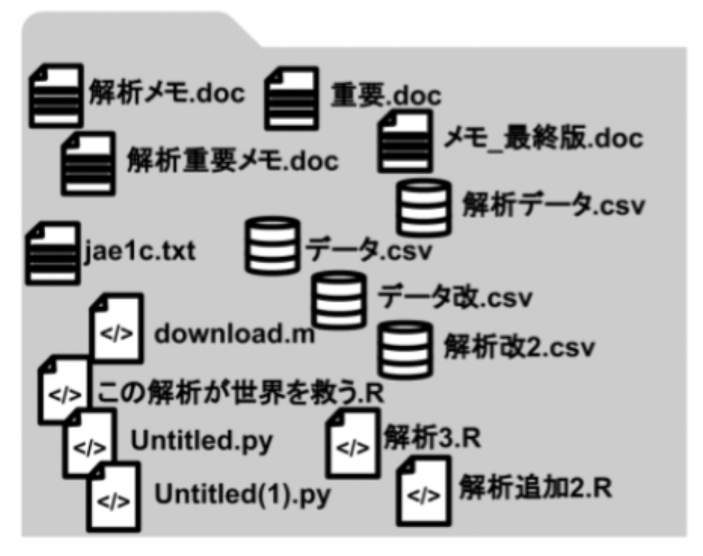

→ どのドキュメントを開けばいい？どのデータを使う？どのコードから実行すればいい？

---
# なぜ解析が再現しない？

- エクセルで生データの処理　→　SPSSにデータを読み込み　→　SPSSでの出力結果から数値をコピペ　→　エクセルで図表の作成

→ この作業過程でミスが混入しないとは限らない.med[(査読・論文でも見かけるありえない数値はコピペミスの氷山の一角)]


---
# なぜ解析が再現しない？

- Rパッケージに限らず，ソフトウェア開発は加速
- 正式リリースの前にβ版を発表し，FBをもらいつつ改善する方法も増える.med[(アップデートによって結果が再現しなくなる)]
- OSなどの環境の違いも結果の再現性に影響する


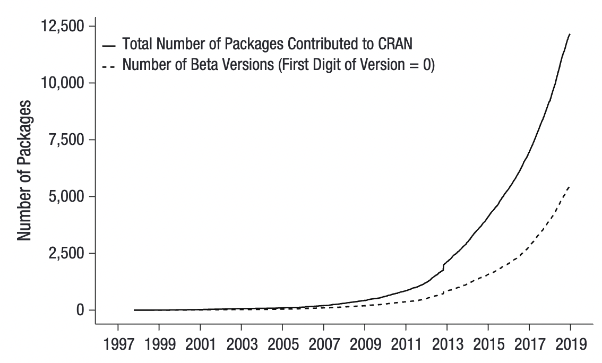

Epskamp(2019)

---
# なぜ解析が再現しない？


- 相互運用・再利用を想定した形式でデータとコードを管理していない

- コピペミスが混入する余地があるワークフロー

- ソフトウェア・OSのバージョンなどの環境が共有できていない

---

# 修士から博士への進学率の減少


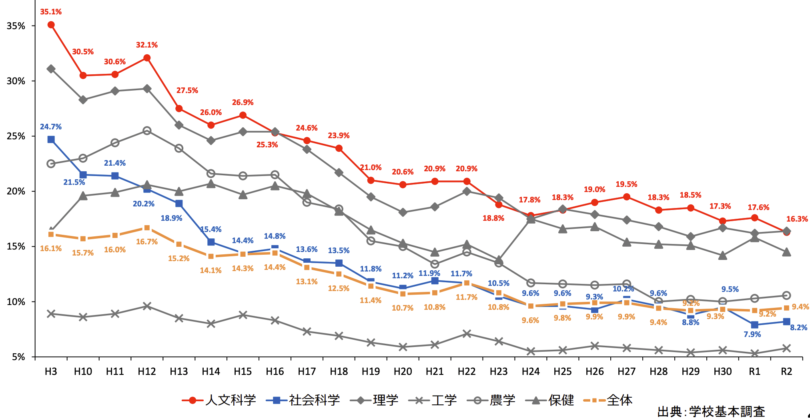

.small[[中央教育審議会大学分科会大学院部会「人文科学・社会科学系における大学院教育改革の方向性」の「人文科学・社会科学系における大学院教育の関連データ集」](https://www.mext.go.jp/b_menu/shingi/chukyo/chukyo4/004/mext_01176.html)]
---
# 大学や心理学を取り巻く環境の変化


- 少子化を含めて大学を取り巻く環境は厳しくなってきている

- 事前登録，オープンデータ・マテリアル，サンプルサイズ設計，高度な統計解析など，研究で要求されるものは増加している

- 博士の院生が研究室のインフラを整備することもあったが，院生の減少にともなって，教員が整えていく必要がある


---
# 問題のまとめ

- フォルダ構成やコピペ汚染の問題

→ 解析のパッケージ化(github, research compendium, psyinfr)

- OSやソフトのバージョンの問題

→ 解析環境のパッケージ化(Docker)

- 研究室インフラの整備

→ Dockerベースの研究室クラウド基盤(Rstudio server, JupyterHUb, リサーチモジュールとWordPress, JATOSとCBAT)

---

class: center, middle

#　解析のパッケージ化

---
### 方法の再現可能性を高める:解析のパッケージ化
- 実行するコードの順番や説明を入れたり，データの場所が分かりやすいようにフォルダを作成(ソフトのパッケージ化を意識した**Research Compendium**.med[(Marwick et al., 2018)]の利用)

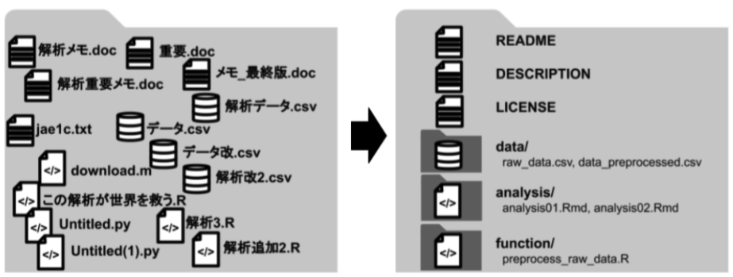

---
# Research Compendium

- Marwick et al.(2018)では，規模ごとに [Research Compendium](https://research-compendium.science/)を提案している。

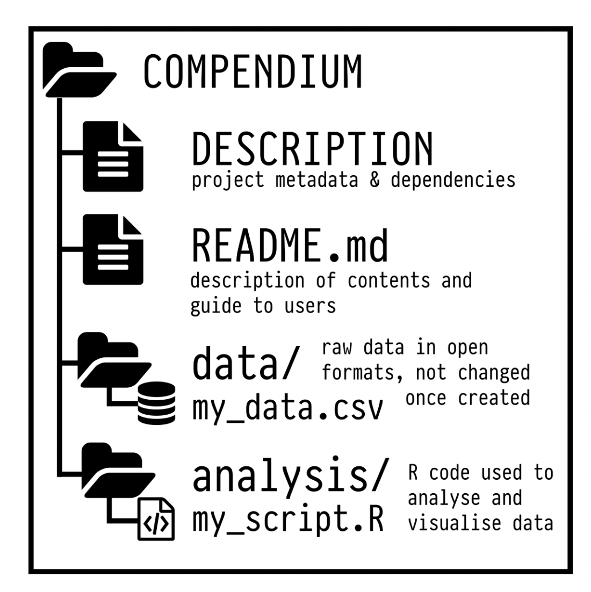
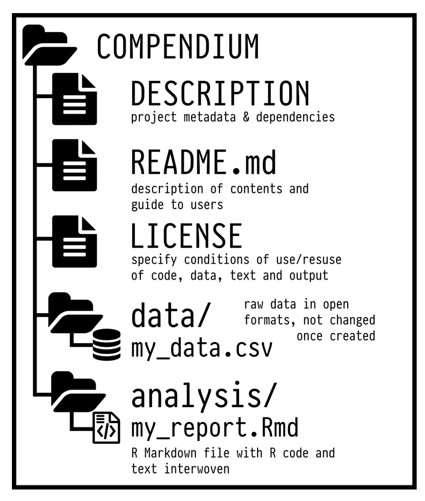
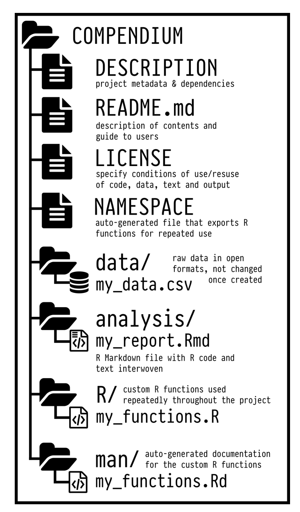

---

###  Research Compendium (小規模)

- 小規模には，説明(DESCRIPTION, README),dataフォルダ，analysisフォルダで良い。

---

### Research Compendium (中規模)

- 中規模の例ではLicenseが追加されている。公開する場合は，ライセンスを考える。

---

### Research Compendium (大規模)

- 大規模では，R関数を繰り返し使うためのNAMESPACE，RのfunctionをいれるRフォルダやその説明をいれるmanフォルダが追加される。
- functionはanalysisのコードを見やすくするためには重要と思われる。


---
# psyinfr

- psyinfrは心理学のインフラツールとなることを目的としたRパッケージ（国里がゼミ用に作っている野良Rパッケージ）

- [https://github.com/ykunisato/psyinfr](https://github.com/ykunisato/psyinfr)に使用法の説明がある。

- インストール：GitHub経由でインストールができます(事前にremotesパッケージを入れておく必要があります)

```{r eval=FALSE, echo=TRUE}
remotes::install_github("ykunisato/psyinfr")
```

---
## psyinfrによるResearch Compendiumの準備

- 以下のコードを実行すると，Marwick et al.(2018)のResearch Compendiumを参考にした卒論・修論用Research Compendiumが用意される

- フォルダ・ファイルの準備＆README.md, paper.Rmd(論文執筆用ファイル)，Analysis01.Rmd(分析用ファイル)が開く

```{r eval=FALSE, echo=TRUE}
psyinfr::set_rc()
```

---

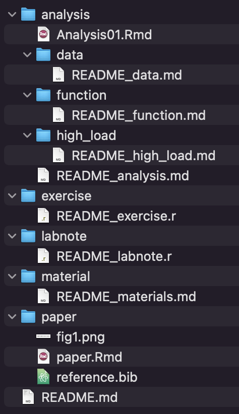

# psyinfr::set_rc()
- analysisフォルダ：分析用Rmdファイル(Analysis01.Rmd)，dataフォルダ（データをいれる），functionフォルダ（Rの関数のファイルをいれる），high_loadフォルダ（高負荷な計算用のフォルダ）
- exercise: ゼミでの演習課題で使うフォルダ
- labnote: ラボノート（後述）用のフォルダ
- material: マテリアル用のフォルダ（質問紙，認知課題など）
- paper: 卒論・修論用のRmdファイルなどが入っている

---
# psyinfraのおまけ機能

### jsPsych課題作成テンプレートの準備

- set_cbat("認知課題名（英語）","jsPsychのバージョン")を実行すると，exerciseフォルダ内に指定した認知課題名のフォルダを作成し，必要なjsPsych関連ファイルがダウンロードされます。

- 特に設定をしなくても，その中にあるtask.jsファイルに書き込むだけでjsPsych課題が作成できます。


```{r eval=FALSE, echo=TRUE}
psyinfr::set_cbat("stroop","7.1.1")
```

---
### 方法の再現可能性を高める:解析のパッケージ化
- データから最終的な結果までが追跡できるようにコードとドキュメントを用意.med[（スタイルガイド，コードへのコメントも）]

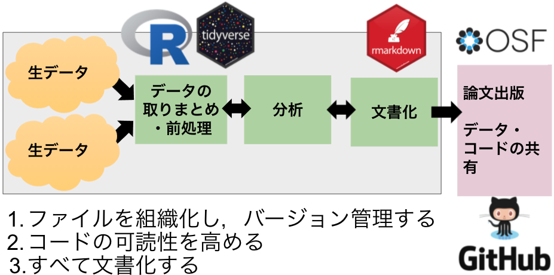

---
# GitHubによるバージョン管理

- Gitは，プログラムのコードなどの変更履歴を記録・追跡するための分散型バージョン管理システム(Wikipedia)

- GitHubは，Gitをベースにしたコードの共有用リポジトリになる。

- GitHubは，特定のユーザーしか閲覧・変更ができないプライベートリポジトリも設定できる。

- [GitHubの準備からRstudioでの設定方法](https://kunisatolab.github.io/main/how-to-github.html)

---
# GitHubによる研究のバージョン管理

- 卒論・修論・執筆中の論文は，バージョン管理して戻れるようにする。

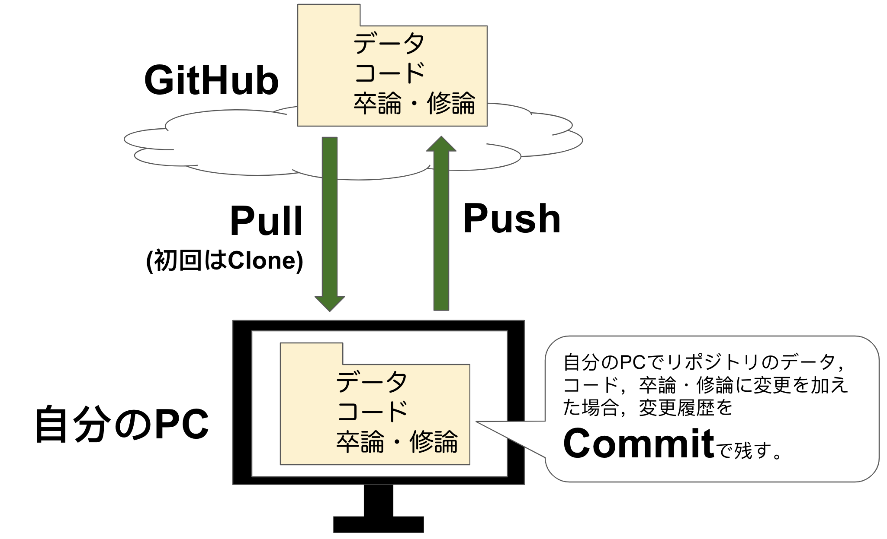

---
class: middle

# GitHubいいかもしれんけど，面倒...
---
## ラボノートとバージョン管理を自動化(開始時)

- GitHubの設定をした上で，その日の研究の開始時に以下の関数を実行する
 - GitHubのリポジトリからプルを実行
 - ラボノート用Rmdファイルを作成

```{r eval=FALSE, echo=TRUE}
psyinfr::researchIn()
```

- プルをするので，GitHubリポジトリの最新の情報がローカルに反映される

- ラボノートは自動で開くので，適宜メモをとりながら研究を実施して，適宜knitをして確認する。

---
## ラボノートとバージョン管理を自動化(終了時)

- その日の研究の終了時に以下の関数を実行する
 - ラボノートを保存
 - 変更加えたファイルにコミットを加えた上で，GitHubにプッシュ

```{r eval=FALSE, echo=TRUE}
psyinfr::researchOut()
```


- 日々の研究は，researchIn()で初めて，researchOut()で終わる(ラボノートとバージョン管理ができる)

- バックアップ先がOSFが良い場合は，up2osf()も使える

---
# 解析のパッケージ化のまとめ

- 再現可能な解析を実施するには，Research Compendiumとバージョン管理が大切

- psyinfrパッケージのset_rc()でResearch Compendiumが簡単につくれる。

- バージョン管理にはGitHubなどが使えるが，なれるまで手間なので，psyinfr::researchIn()とpsyinfr::researchOut()を使って自動化できる。

---
class: center, middle

#　解析環境のコンテナ化

---
### 方法の再現可能性を高める:解析環境のコンテナ化
- 解析環境(OSやソフト)が違うとそもそも実行もできないor結果が再現できないことがある。

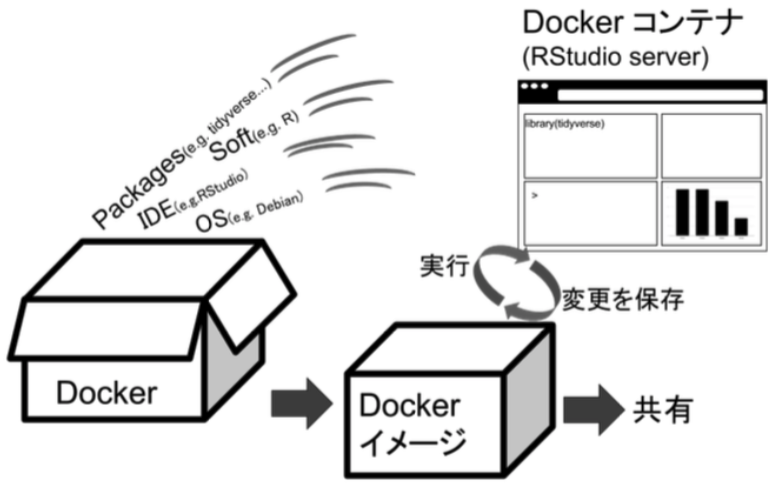

(1)解析環境とバージョン情報を公開する

(2)解析環境をひとまとまりにコンテナ化して共有する(Docker)
---
# Dockerとは

- Docker社が提供するコンテナ型の仮想環境を作成・配布・実行するためのプラットフォーム

- 雑に言うと，RやRstudioなどのアプリとそれを動かすための最小限の仮想環境(基本LinuxベースのOS)を１つの箱に入れて使える仕組み。コンテナはイメージにできるので，配布できる。

- Windowsを使っていても，Macを使っていても，すぐに同じRやRstudioを動かす環境を作ることができる

→それぞれの環境に依存せずに解析環境を共有することができる

---

## 統計解析でDockerを導入する利点


- 統計解析環境を再現可能にできる（使ったDockerイメージを配布すればいいだけ）

- 最初にDockerさえインストールできれば，あとはコマンド１つで，簡単に面倒なソフトのインストールなどが終わる

- プラウザで作業ができるので，今どきの仕事スタイルにあっている

- サーバー上にDockerを導入すれば，簡単に自分のサーバーでサービスを稼働できる（後述）

---
## Rocker: RとRstudio用のDocker

- RやRstudio用のDockerコンテナをつくる[Rockerプロジェクト](https://hub.docker.com/u/rocker)が公開したイメージが便利(Nüst et al., 2020)

.med[
- rocker/r-ver: R
- rocker/rstudio: rocker/r-verにRStudio Serverを追加
- rocker/tidyverse: rocker/rstudioにtidyverseやdevtoolsパッケージを追加
- rocker/verse:	rocker/tidyverseにtexや出版関連パッケージを追加
- rocker/geospatial: rocker/verseにgeospatialパッケージを追加
- rocker/binder: rocker/geospatialにmybinder.org関連ソフトを追加
- rocker/shiny: rocker/r-verにshiny serverを追加
- rocker/shiny-verse: rocker/shinyにtidyverseパッケージを追加
- rocker/cuda: rocker/r-verでCUDAを利用可能に
- rocker/ml: rocker/cudaにrocker/tidyverseと同様のものを追加
- rocker/ml-verse: rocker/mlにrocker/geospatialと同様のものを追加
]
---
# Dockerのインストール

- インストール方法：[Docker社のHP](https://www.docker.com/)より，ダウンロードしてインストールする（OSごとにインストール方法は違うので調べてインストール，Dockerのアカウントを作ってログインする必要もあるかも？）

- Dockerのインストール方法は，[2021年日心TWS「再現可能な日本語論文執筆入門:jpaRmdで実現する再現可能で低コストな日本語論文執筆のはじめの一歩」](https://ykunisato.github.io/jpa2021-tws-jpaRmd/02.html)参照 

---
# rocker/rstudioを試してみよう！

- まずは，あまりイメージサイズが大きくないrocker/tidyverseを試してみる。
- なお，Dockerを使うにあたって，15~20GBくらいハードディスクに余裕があると良い

- Macのターミナルで以下を実行

```{r eval=FALSE, echo=TRUE}
docker run -e PASSWORD=password -p 8787:8787 -v $(pwd):/home/rstudio -d --name rstudio rocker/tidyverse
```

- Windowsのコマンドプロンプトで以下を実行

```{r eval=FALSE, echo=TRUE}
docker run -e PASSWORD=password -p 8787:8787 -v "%cd%":/home/rstudio -d --name paper ykunisato/paper-r
```

- "-e DISABLE_AUTH=true"をいれて，パスワード入力を省略することもできる

---
# rocker/rstudioを試してみよう！

- http://localhost:8787/ にアクセスして，IDにrstudio, パスワードをいれる

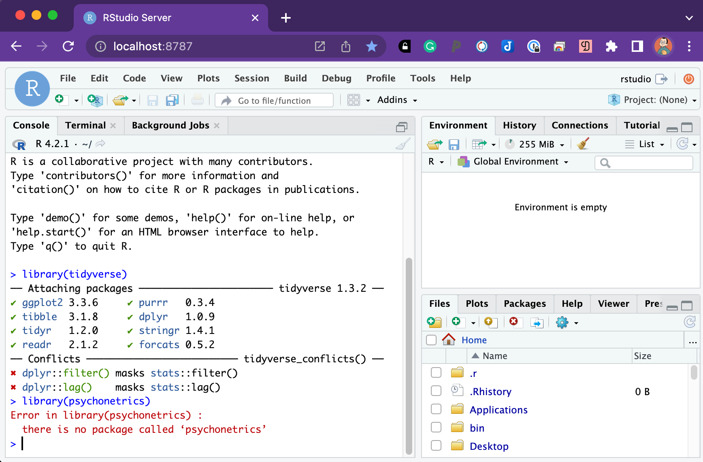

---

## Dockerコマンド
### コンテナの確認

- コンテナの動作確認するには，ターミナル・コマンドプロンプトに以下を打ち込む。STATUSがUpになっているとコンテナが動いている

```{r eval=FALSE, echo=TRUE}
docker ps -a
```

- コンテナが停止している場合は(STATUSがExitedになっている)，コマンドプロンプトに以下を打ち込んで，コンテナを開始する

```{r eval=FALSE, echo=TRUE}
docker start コンテナ名
```

---

## Dockerコマンド
### コンテナの停止と削除

- コンテナが不要になったら，停止して削除する。コンテナの停止には，コマンドプロンプトに以下を打ち込む

```{r eval=FALSE, echo=TRUE}
docker stop コンテナ名
```

- コンテナの削除には，コマンドプロンプトに以下を打ち込む

```{r eval=FALSE, echo=TRUE}
docker rm コンテナ名
```

---

## Dockerコマンド
### イメージの削除

- rmしてもコンテナが削除されただけでダウンロードしたイメージは残っている
- 以下をコマンドプロンプトに打ち込んで，イメージの状況を確認する。削除したいイメージのIMAGE IDをコピーする

```{r eval=FALSE, echo=TRUE}
docker images
```

- 上記でコピーしたIMAGE IDを使って，以下をコマンドプロンプトに打ち込んで，イメージを削除する

```{r eval=FALSE, echo=TRUE}
docker rmi IMAGE_ID
```

---
# Docker Hub
- Docker Hub(https://hub.docker.com/ )では，多数のイメージが公開されている。国里がよく使うイメージは以下になる

1. [paper-r](https://hub.docker.com/r/ykunisato/paper-r): 国里がrocker/verseをベースに各種心理関連パッケージやStan, python, Juliaなどもモリモリに追加したイメージ(使い方はrocker/rstudioと同様)
2. [ccp-lab-j](https://hub.docker.com/r/ykunisato/ccp-lab-j):国里がjupyter/scipy-notebookをベースにjuliaの追加と各種Pythonパッケージを追加したイメージ
3. [jatos](https://hub.docker.com/r/jatos/jatos/): JsPsychやlab.jsなどをホスティングできるサーバーのJATOS (Just Another Tool for Online Studies) 用のイメージ

---
# ccp-lab-jの使い方(1)

- Macの場合，以下をターミナルで実行("token that you set"は変更)

```{r eval=FALSE, echo=TRUE}
docker run -d --name notebook -v `pwd`:/home/jovyan/work -p 8888:8888 -e JUPYTER_ENABLE_LAB=yes ykunisato/ccp-lab-j start-notebook.sh --NotebookApp.token="token that you set"
```

- Windowsの場合，以下をコマンドプロンプトで実行("token that you set"は変更)
```{r eval=FALSE, echo=TRUE}
docker run -d --name notebook -v "%cd%":/home/jovyan/work -p 8888:8888 -e JUPYTER_ENABLE_LAB=yes ykunisato/ccp-lab-j start-notebook.sh --NotebookApp.token="token that you set"
```

---
# ccp-lab-jの使い方(2)

- http://localhost:8888/ にアクセスする

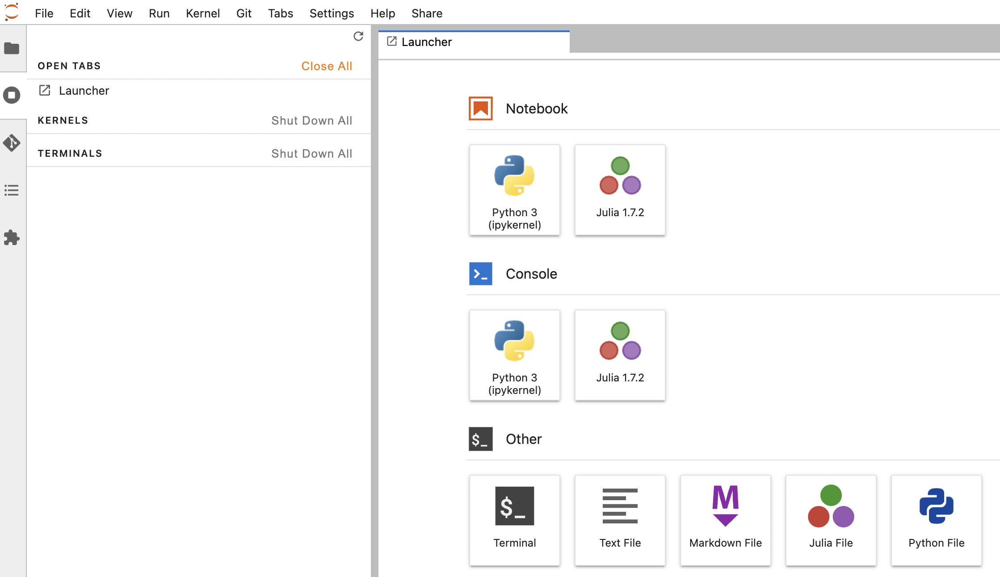

---
# JATOSの使い方(1)


- Macの場合，以下をターミナルで実行

```{r eval=FALSE, echo=TRUE}
docker run -d -p 9000:9000 -e TZ=Asia/Tokyo -v $(pwd)/jatos/study_assets_root:/opt/docker/study_assets_root --name jatos jatos/jatos:latest
```

- Windowsの場合，以下をコマンドプロンプトで実行

```{r eval=FALSE, echo=TRUE}
docker run -d -p 9000:9000 -e TZ=Asia/Tokyo -v %cd%/jatos/study_assets_root:/opt/docker/study_assets_root --name jatos jatos/jatos:latest
```

---
# JATOSの使い方(2)

- http://localhost:9000/ にアクセスする(最初は，admin, adminでログインする)

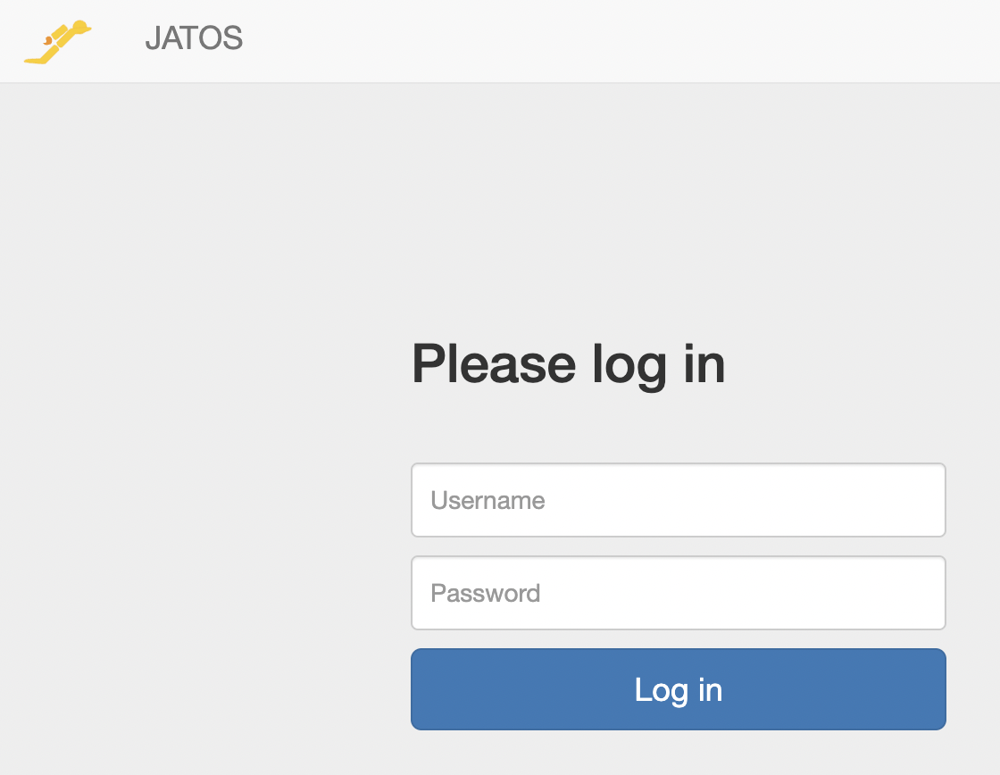

---
# マイDockerの作り方

- DockerHubで使いたいイメージを探して使うのでもdockerは便利

- 自分でカスタマイズすれば，マイ環境を共有したり，再利用できる

- rocker/tidyverseに[[TWS-007] 心理ネットワークアプローチ入門:横断データ解析を中心に(樫原 潤, 国里愛彦, 竹林由武, 菅原大地)](https://confit.atlas.jp/guide/event/jpa2022/subject/39901-08-01/advanced)で使っているRパッケージを追加してみる

- rocker系は8787ポートを使うので，すでに何かコンテナ立ち上げている場合は，止めておく

```{r eval=FALSE, echo=TRUE}
docker stop rstudio
```

---
# Dockerfileの書き方

- Dockerfileという名前のファイルを作って（拡張子はなし），以下を書き込む

```{r eval=FALSE, echo=TRUE}
FROM rocker/tidyverse:latest
LABEL maintainer="Yoshihiko Kunisato <mail>"

RUN apt update && apt install -y libglpk-dev
RUN R -e "install.packages(c('remotes','psych','foreign'), dependencies = TRUE)"
RUN R -e "install.packages(c('bootnet','qgraph','psychonetrics'), dependencies = TRUE)"
RUN R -e "install.packages(c('networktools','NetworkComparisonTest'), dependencies = TRUE)"
```

- FROMでベースとなるイメージを指定する
- LABELでメンテナンスをしている人を書く
- RUNでLinuxのコマンドを実行する。psychonetricsなどはlibglpk-devがないと動かないので，インストール
- Rパッケージは，RUN R -e ""で""内にRコマンドを書いてインストール

---
# Dockerfileのビルド

- Dockerfileがあるフォルダに移動して(cdコマンド)，以下を実行して，ビルドする。最後のykunisato/psynetは好きな名前で良い
- ビルドがうまくいかなこともある（Linuxのコマンドを探すなど，試行錯誤が必要）。

```{r eval=FALSE, echo=TRUE}
docker build ./ -t ykunisato/psynet
```

- imagesでビルドしたイメージを確認する

```{r eval=FALSE, echo=TRUE}
docker images
```


---
# コンテナを起動

- 以下のコマンドでコンテナを起動する.med[（Windowsは省略）]

```{r eval=FALSE, echo=TRUE}
docker run -e PASSWORD=password -p 8787:8787 -v $(pwd):/home/rstudio -d --name psynet ykunisato/psynet
```

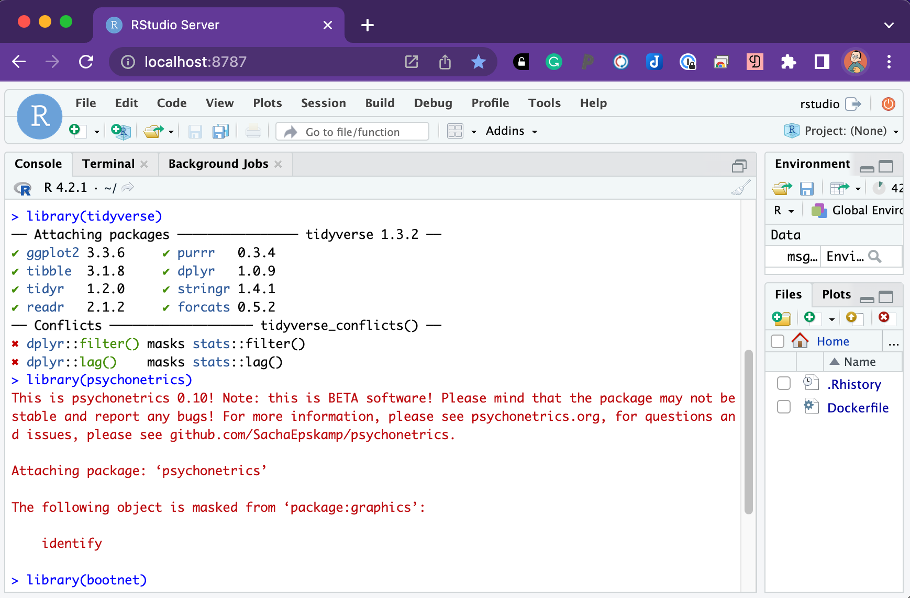

---
# マイDockerの活用

- DockerHubだけでも便利だが，マイDockerfileを設定できれば，自分にぴったりのイメージを用意することができる

- マイDockerfileやイメージがあれば，いつでも再現可能なマイ解析環境を用意できる

- DockerHubにアップロードすると，ベースのイメージがアップデートされると自動で自分のイメージもアップデートできて更新もできる（無料版では制限もある）。世界中で活用される(paper-rはそこそこDLされている)。

---
# 解析環境のコンテナ化のまとめ


- Dockerを使うことで，簡単に統計解析環境を再現可能にできる

- [paper-r](https://hub.docker.com/r/ykunisato/paper-r), [ccp-lab-j](https://hub.docker.com/r/ykunisato/ccp-lab-j), [jatos](https://hub.docker.com/r/jatos/jatos/)などの便利なイメージがDockerHubで共有されている

- 自分の研究で使いやすいようにDockerfileを定義してイメージを作ることができる

---
class: center, middle

#　Dockerベースの研究室クラウド基盤

---
# 

---
# クラウド基盤に必要な機能

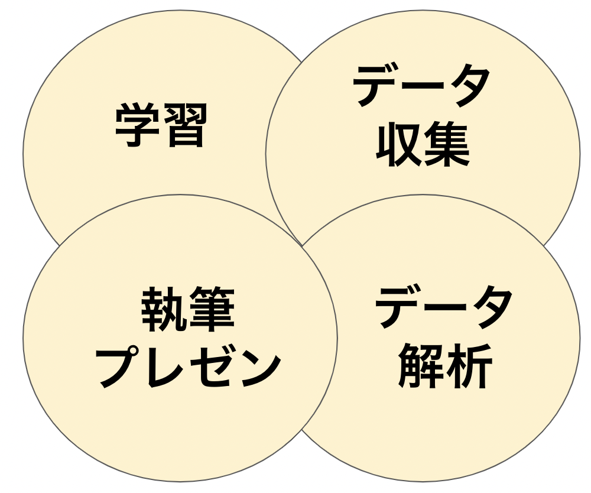
---
# 必要なソフトウェア

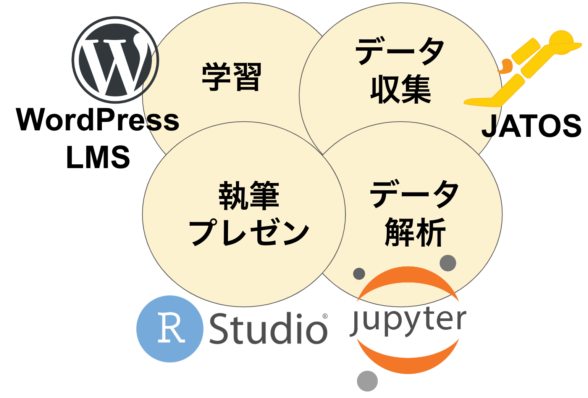
---
# サーバー設定

---

---
# CBAT
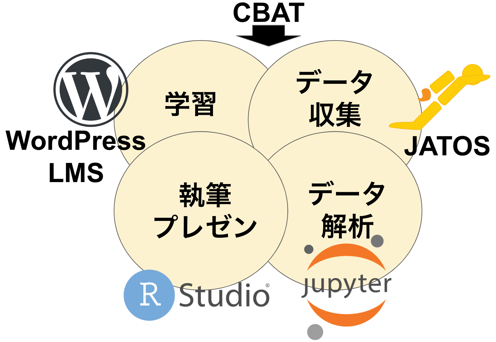


---
## 結果の再現可能性を高める：マテリアルの共有

- 追試を行う上でマテリアルやプロトコルの共有は不可欠だが，まだ一般的ではない(Hardwicke et al., 2021)。

- マテリアルやプロトコルの共有は，(1)結果の再現可能性を高め，(2)研究にかかる時間的コストを減らし，(3)実施時の誤りも減らす。

- .med[例えば，全般性不安尺度のGAD-7の4択の下限は，「not at all」なのに，2012年くらいから「not at all sure」ってタイポが論文上で出現(Zorowitz et al.,2021)。間違った選択肢の研究が147本ある・・・]

---
## 結果の再現可能性を高める：マテリアルの共有

- 第3者が理解できるように，(1)実験・調査・介入のプロトコル，(2)認知課題の刺激とプログラムコード，(3)質問紙の項目と調査に使用したフォーマットを共有する。

- ライセンス上実行環境も共有できる場合は，コンテナ化して共有する.med[(難しい場合は，コードとソフトのバージョンを公開)]。例.[Experiment Factory .med[(Sochat et al., 2018)]](https://expfactory.github.io/)

- 質問紙はライセンス形式が不透明なので，質問紙開発論文では質問項目だけでなく調査フォーマット(コード)も公開し，ライセンスも付与すべき？

---
## [Cognitive & Behavioral Assessment Toolbox](https://cbat.cpsy-lab.com/)


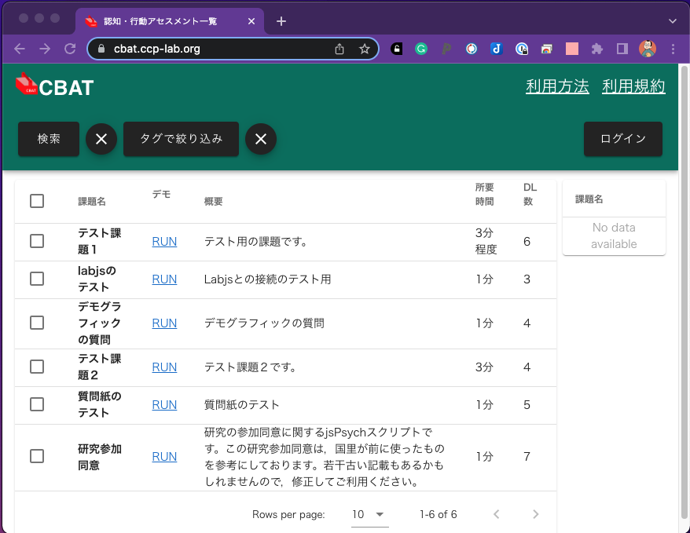
- jsPsychやlab.jsで作成された課題・質問紙を共有するリポジトリを準備中
- 共有された課題は，すぐに試してみたり，研究で利用可能

---
# ライセンスの付与
- ライセンスを付与して，どのような条件で使用可能かを明示する。

→ 以下のようなオープンソース由来のライセンスが使えるが，Creative Commonsは利用条件がわかりやすい。

.med[
- CC0 1.0 Universal
- CC-By Attribution 4.0 International
- MIT License
- Apache License 2.0
- BSD 2-Clause “Simplified” License
- GNU General Public License (GPL) 3.0 or 2.0
- GNU Lesser General Public License (LGPL) 3.0 or 2.1 ...
]
---
.med[**Creative Commons** OSFでデータ共有する場合はCC0 1.0かCC BY 4.0。
CC0 1.0ならクレジットなしで，CC BY 4.0ならクレジットをつければ，個人利用，改変，再配布，商用利用を許可（商標権と特許権は保持される）]

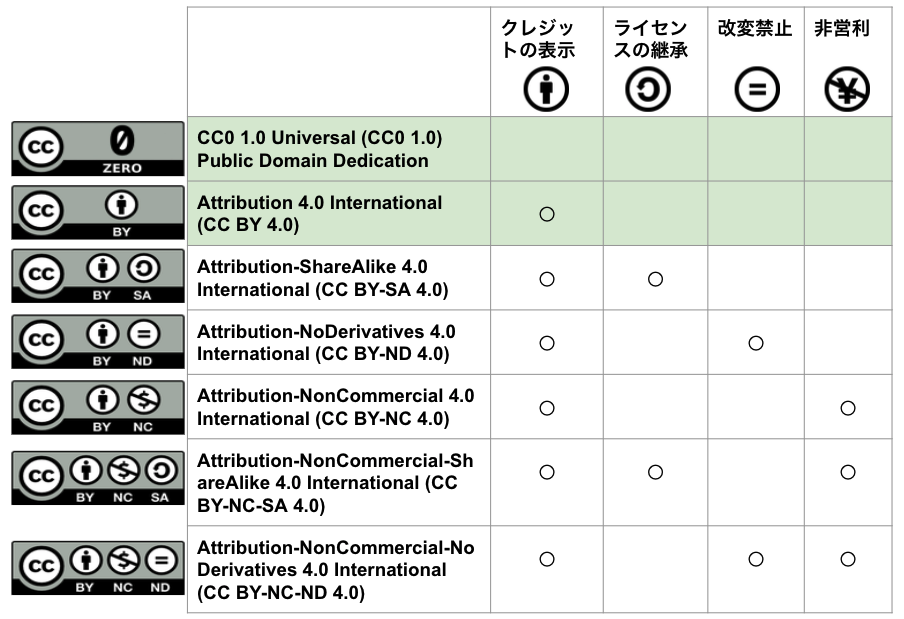
---


```
docker stats -a
```
https://jupyterhub.computational-clinical-psychology-lab.com

https://rstudio.computational-clinical-psychology-lab.com


https://jatos.computational-clinical-psychology-lab.com/

https://wordpress.computational-clinical-psychology-lab.com/

https://traefik.computational-clinical-psychology-lab.com/dashboard/#/

---
### 引用文献
- Breznau, N., Rinke, E. M., Wuttke, A., Adem, M., Adriaans, J., Alvarez-Benjumea, A., Andersen, H. K., Auer, D., Azevedo, F., Bahnsen, O., Balzer, D., Bauer, G., Bauer, P., Baumann, M., Baute, S., Benoit, V., Bernauer, J., Berning, C., Berthold, A., … Nguyen, H. H. V. (2021). Observing many researchers using the same data and hypothesis reveals a hidden universe of uncertainty. In BITSS. https://doi.org/10.31222/osf.io/cd5j9
- Epskamp, S. (2019). Reproducibility and Replicability in a Fast-Paced Methodological World. Advances in Methods and Practices in Psychological Science, 2(2), 145–155.
- 船守美穂(2022) 大学はオープンサイエンスにどのように向き合うか　科学, 192(8), 703-707.
- Hardwicke, T. E., Mathur, M. B., MacDonald, K., Nilsonne, G., Banks, G. C., Kidwell, M. C., Hofelich Mohr, A., Clayton, E., Yoon, E. J., Henry Tessler, M., Lenne, R. L., Altman, S., Long, B., & Frank, M. C. (2018). Data availability, reusability, and analytic reproducibility: evaluating the impact of a mandatory open data policy at the journal Cognition. Royal Society Open Science, 5(8), 180448.
- Hardwicke, T. E., Thibault, R. T., Kosie, J. E., Wallach, J. D., Kidwell, M. C., & Ioannidis, J. P. A. (2021). Estimating the Prevalence of Transparency and Reproducibility-Related Research Practices in Psychology (2014-2017). Perspectives on Psychological Science: A Journal of the Association for Psychological Science, 1745691620979806.
- Goodman, S. N., Fanelli, D., & Ioannidis, J. P. A. (2016). What does research reproducibility mean? Science Translational Medicine, 8(341), 341ps12.
- Marwick, B., Boettiger, C., & Mullen, L. (2018). Packaging Data Analytical Work Reproducibly Using R (and Friends). The American Statistician, 72(1), 80–88.
- Obels, P., Lakens, D., Coles, N. A., Gottfried, J., & Green, S. A. (2020). Analysis of Open Data and Computational Reproducibility in Registered Reports in Psychology. Advances in Methods and Practices in Psychological Science, 2515245920918872.
- Nüst, D., Eddelbuettel, D., Bennett, D., Cannoodt, R., Clark, D., Daróczi, G., Edmondson, M., Fay, C., Hughes, E., Kjeldgaard, L., Lopp, S., Marwick, B., Nolis, H., Nolis, J., Ooi, H., Ram, K., Ross, N., Shepherd, L., Sólymos, P., … Xiao, N. (2020). The Rockerverse: Packages and Applications for Containerisation with R. The R Journal, 12(1), 437.
- Sochat, V. (2018). The Experiment Factory: Reproducible Experiment Containers. The Journal of Open Source Software, 3(22), 521.
- Zorowitz, S., Bennett, D., Choe, G., & Niv, Y. (2021). A recurring reproduction error in the administration of the Generalized Anxiety Disorder scale. The Lancet. Psychiatry, 8(3), 180–181.